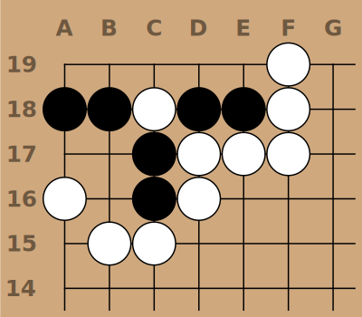

# Sgf Render

.

CLI to generate SVG or PNG output from an SGF file.

SVG output is clean and well labeled for easy re-styling or modification.

Supports [numbered
moves](https://raw.githubusercontent.com/julianandrews/sgf-render/master/demo/simple-numbered.svg),
[markup](https://raw.githubusercontent.com/julianandrews/sgf-render/master/demo/markup.svg),
and
[several](https://raw.githubusercontent.com/julianandrews/sgf-render/master/demo/minimalist-numbered.svg)
[styles](https://raw.githubusercontent.com/julianandrews/sgf-render/master/demo/prob45-fancy.svg).

## Installation

Check the [releases](https://github.com/julianandrews/sgf-render/releases) page
on GitHub for pre-built binaries.

Note that the windows, and linux-musl versions are compiled without PNG
support. If you need PNG support on a platform without it consider building
`sgf-render` yourself. Alternatively, you can always install
[ImageMagick](https://imagemagick.org/index.php) to convert the SVG into any
format you like.

If you have `cargo` installed, you can also install the package from crates.io:

```
$ cargo install sgf-render
```

## Building

If you have `git` and `cargo` installed you can also build from source:

```
$ git clone https://julianandrews/sgf-render
$ cd sgf-render
$ cargo build --release
$ ./target/release/sgf-render -h
```

## Usage

```
Usage: sgf-render [FILE] [options]

Options:
    -o, --outfile FILE  Output file. SVG and PNG formats supported.
    -n, --node-num NUM  Node number to render (default 1). Note that SGFs may
                        have nodes without moves.
    -w, --width WIDTH   Width of the output image in pixels (default 800)
    -s, --shrink-wrap   Draw only enough of the board to hold all the stones
                        (with 1 space padding)
    -r, --range RANGE   Range to draw as a pair of corners (e.g. 'cc-ff')
        --style STYLE   Style to use. One of 'simple', 'fancy' or 'minimalist'
        --move-numbers  Draw move numbers (disables other markup).
        --no-board-labels
                        Don't draw position labels.
        --no-marks      Don't draw SGF marks.
        --no-triangles  Don't draw SGF triangles.
        --no-circles    Don't draw SGF circles.
        --no-squares    Don't draw SGF squares.
        --no-selected   Don't draw SGF selected.
        --no-dimmed     Don't draw SGF dimmmed.
        --no-labels     Don't draw SGF labels.
        --no-lines      Don't draw SGF lines.
        --no-arrows     Don't draw SGF arrows.
        --first-move-number NUM
                        First move number to draw if using --move-numbers
    -h, --help          Display this help and exit
```

If `FILE` isn't provided, `sgf-render` will read from stdin. If `--outfile`
isn't provided `sgf-render` will print the resulting SVG to stdout.

## Contributing
Pull requests are welcome! For major changes, please open an issue first to
discuss what you would like to change.

Feature requests are also welcome! The goal is to make this a general purpose
sgf diagram generation tool. Just open an issue at
[GitHub](https://github.com/julianandrews/sgf-render/issues).
